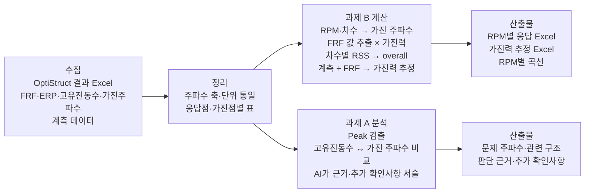

# 지게차 소음·진동 해석 결과 분석·RPM별 응답 계산 자동화 — 프로젝트 기획서

| 항목 | 내용 |
|---|---|
| 리포 | data09-04 |
| 제출자 | 김영현 |
| 직무·소속 | 소음진동 해석 담당 (소속 부서명은 원문에 없음) |
| 과정 | 현장 데이터 디지털화 전문가과정 1차수 |
| 작성일 | 2026-09-28 |
| 문서 상태 | 초안 v0.3 — 2026-09-29 수강생 추가 요청(가진력 산정·추정 보완) 반영 (11장) |

> 제출자는 두 번 게시했습니다. 두 게시물은 같은 데이터(FRF 해석 결과 Excel)를 쓰지만 하려는 일이 다르므로 **과제 A / 과제 B**로 나누어 적습니다.
> - **과제 A** (게시물 1, 2026-09-09): OptiStruct 해석 결과(ERP·FRF·고유진동수) 분석 자동화 — Peak·문제 주파수 검출, 가진 주파수 ↔ 고유진동수 비교, 문제 구조·추가 확인사항 제시
> - **과제 B** (게시물 2, 2026-09-28): 단위 가진 FRF 결과로부터 RPM별 소음·진동 응답 계산, 계측 데이터가 있을 때 가진력 추정
>
> **1차 개발 대상은 과제 B**로 합니다. 제출자가 2026-09-28 댓글로 「과제 B를 우선으로 하고 여유가 된다면 과제 A를 진행」하겠다고 확인했습니다(v0.2 반영). 이 순서가 맞는 이유는 ① 가장 최근 게시물로 제출자의 현재 관심사이고, ② 계산식(FRF × 가진력, 차수별 RSS로 overall)이 원문에 명시돼 결과가 맞는지 확인할 수 있으며, ③ 과제 B에서 만드는 「FRF 엑셀 읽기·주파수 축 처리」가 과제 A의 Peak 검출에 그대로 재사용되기 때문입니다.

## 1. 추진 배경과 현안

**공통 배경**

- 지게차 소음·진동 해석 후 ERP, FRF, 고유진동수 등의 결과를 수작업으로 분석하고 있습니다.
- 해석 결과는 Excel로 나와 있어(OptiStruct 결과) 데이터화는 이미 되어 있으나, 이를 읽고 판단하는 과정이 반복 수작업입니다.

**과제 A — 해석 결과 분석**

- 주요 Peak와 문제 주파수 확인, 가진 주파수와 고유진동수 비교에 반복적으로 시간이 듭니다.
- 기존 해석 결과 데이터(Excel)를 활용해 분석 업무를 AI로 지원하고자 합니다.

**과제 B — RPM별 응답 계산**

- 단위 가진으로 구한 소음·진동 FRF 해석 결과로부터 RPM별 응답을 신속하게 계산하고 싶습니다.
- 이를 위해 두 가지가 필요합니다.
  1. 신뢰성 있는 가진력 데이터 추정
  2. RPM 조건에 맞는 FRF 값 추출
- 계산 방식은 제출자가 정했습니다.
  - RPM별 응답 = FRF 결과 × 가진력
  - overall = 차수별 성분의 RSS(제곱합의 제곱근)

## 2. 목표

**최종 목표**

해석 결과 분석 시간과 소음·진동 문제 대응 시간을 단축합니다(게시물 1 목표).
FRF 엑셀을 넣으면 RPM별 응답·overall이 계산되고(과제 B), 주요 Peak·문제 주파수와 그 판단 근거가 정리되는(과제 A) 도구를 만듭니다.

**1차 개발 목표 (과제 B)**

- 입력: 단위 가진 FRF 엑셀 + 가진력(차수별) + RPM 범위 + 차수 목록
- 처리: 각 RPM·차수에 대해 가진 주파수를 구하고, 그 주파수의 FRF 값을 뽑아 가진력을 곱한 뒤, 차수별 성분을 RSS로 합쳐 overall 계산
- 출력: RPM별 소음·진동 응답 엑셀(차수별 성분 + overall)
- 계측 데이터가 주어질 경우 가진력 추정 엑셀(1차는 단일 가진점 기준, (가정))

## 3. 보유 데이터

| 데이터 | 형태 | 규모·주기 | 비고(민감도 등) |
|---|---|---|---|
| 단위 가진 소음·진동 FRF 해석 결과 | Excel | 해석 건별 (주파수 범위·간격 미기재) | 과제 A·B 공통. OptiStruct 결과. 개발 제품 해석 자료라 사내 기밀(가정) |
| ERP 결과 | Excel | 해석 건별 | 과제 A |
| 고유진동수 | Excel | 해석 건별 | 과제 A. 모드 번호·모드 형상 설명 포함 여부 미확인 |
| 가진 주파수 | Excel | 해석 건별 | 과제 A. 엔진·유압 등 가진원 구분 여부 미확인 |
| 계측 데이터 | 미기재 | 「주어질 경우」 | 과제 B 가진력 추정 입력. 형식(시간 신호/RPM별 차수 응답) 미확인 |
| 가진력 데이터 | 없음 (추정 대상) | — | 과제 B의 핵심 입력. 현재 「신뢰성 있는」 값이 없는 상태 |

- 첨부파일은 없습니다. 엑셀의 시트·열 구성(주파수 열, 실수/허수 또는 크기/위상, 단위)을 알아야 계산기를 확정할 수 있습니다(10장).

## 4. 해결 방안 개요

**과제 B 계산 흐름 (1차 개발 명세 초안)**

1. 각 RPM에서 차수 k의 가진 주파수 f = k × RPM / 60 (Hz) 을 구합니다. (가정: 차수는 회전 차수 기준. 제출자 확인 필요)
2. FRF 표에서 f에 해당하는 값을 뽑습니다. 해석 주파수 간격 사이에 있으면 인접 두 점을 보간합니다(보간 방식은 선형 (가정), 선택 가능하게).
3. 차수 k 성분 응답 = |FRF(f)| × 가진력(k, RPM).
4. overall(RPM) = √( Σ_k 성분_k² ) — 원문 「참고 2」.
5. 결과를 RPM × (차수별 성분, overall) 표로 엑셀 출력. 소음이 dB 표기가 필요하면 기준값으로 변환(기준값 확인 필요).

**가진력 추정 (계측 데이터가 있을 때)**

- 같은 RPM·차수에서 가진력 = 계측 응답 ÷ |FRF(f)| (가정: 단일 가진점·단일 응답점).
- 응답점이 여러 개면 응답점별 추정값을 함께 보여 주고, 최소제곱으로 하나의 값을 구하는 방식을 선택지로 둡니다(가정). 추정값이 튀는 구간(FRF가 매우 작은 반공진 부근)은 표시합니다.

## 5. 주요 기능

| 기능 | 설명 | 과제 | 우선순위 |
|---|---|---|---|
| FRF 엑셀 불러오기 | 주파수 열·응답점 열 지정, 크기/위상 또는 실수/허수 선택, 단위 입력 | 공통 | MVP |
| RPM·차수 설정 | RPM 범위·간격, 차수 목록(예: 1차·2차 등, 제출자 입력) | B | MVP |
| RPM 조건 FRF 값 추출 | 가진 주파수 계산 후 FRF 보간 추출. 해석 주파수 범위를 벗어나면 경고 | B | MVP |
| RPM별 응답 계산 | FRF × 가진력, 차수별 성분 | B | MVP |
| overall 계산 | 차수별 RSS | B | MVP |
| 결과 엑셀·그래프 | RPM별 차수 성분·overall 표, RPM-응답 곡선 | B | MVP |
| 가진력 추정 | 계측 응답 ÷ FRF, 응답점별 비교, 반공진 부근 경고 | B | MVP — 1단계는 「RPM·차수별 계측 응답 표」 입력 기준(가정), 계측 형식 확인 후 2단계에서 보완 |
| 가진력 입력 보완 (v0.3) | RPM 연동 벡터 입력, 차수별 scale factor(기준 차수 하나만 입력) | B | 2026-09-29 요청 — 반영 (11장) |
| 가진력 추정 보완 (v0.3) | 계산/계측 오차 최소화: scale 고정 시 기준 차수 RPM별 크기, 미고정 시 차수별 n차 다항식 계수 | B | 2026-09-29 요청 — 반영 (11장) |
| Peak 검출 | FRF·ERP에서 주요 Peak 주파수·크기 목록(상위 N개, 임계값 설정) | A | 확장(2단계, 과제 B 이후 여유가 있을 때 — 제출자 확인) |
| 가진 주파수 ↔ 고유진동수 비교 | 설정한 여유 범위(예: ±%, 기준은 제출자 확인) 안에 드는 쌍을 표시 | A | 확장(2단계) |
| AI 판단 보조 | 검출 결과를 근거로 문제 가능 구조·추가 확인사항 서술. 수치 근거를 반드시 함께 표시 | A | 확장(3단계) |
| 해석 이력 비교 | 설계 변경 전후 FRF·응답 비교 | 공통 | 확장 |

## 6. 기대 산출물

**과제 B**

- RPM별로 계산된 소음·진동 응답 엑셀 파일(차수별 성분 + overall).
- 계측 데이터가 주어질 경우 가진력 추정 엑셀 파일.
- RPM-응답 그래프(화면·이미지 저장).

**과제 A**

- 해석 건별 분석 결과: 주요 문제 주파수 / 관련 구조 / 판단 근거 / 추가 확인사항(게시물 1의 출력 정의 그대로).

## 7. 기술 구성

| 과정 도구 | 이 과제에서의 쓰임 |
|---|---|
| DAY2 코랩/Python | 계산식 검증용 노트북(제출자가 손계산·기존 결과와 대조). 1차 계산기의 기준 구현 |
| 생성형 AI | 과제 A에서 Peak·비교 결과를 사람이 읽을 문장(판단 근거·추가 확인사항)으로 정리 |
| DAY4 Dify/NotebookLM | (선택) 과거 해석 보고서·대책 사례를 지식베이스로 두고, 비슷한 문제 주파수의 과거 대응을 찾아 줌 |
| DAY5 Make | 이 과제에서는 쓰임이 적음. 해석 결과 공유 메일 정도(선택) |

**개발 형태 (우리가 만드는 것)**

- **설치 없이 브라우저에서 도는 정적 웹 도구**. 엑셀을 끌어다 놓으면 브라우저 안에서만 계산하고 결과 엑셀을 내려받습니다. 해석 데이터가 외부로 나가지 않습니다.
- 같은 계산을 하는 Python 스크립트(코랩 노트북)를 함께 제공해, 웹 도구 결과와 교차 확인합니다.
- 계산 부분은 AI를 쓰지 않는 결정적 계산으로 만듭니다. AI는 과제 A의 설명 문장 작성에만 씁니다. 수치 판단(Peak·주파수 일치 여부)은 규칙으로 계산하고 AI는 그 결과를 설명만 하게 해, AI가 수치를 지어내지 않게 합니다.

## 8. 개발 단계

**1단계 — 지금 바로 개발 가능한 부분 (과제 B)**

제출자 확인(2026-09-28 댓글): 과제 B를 우선하고, 여유가 되면 과제 A를 진행합니다. 따라서 1단계는 과제 B만 다루고, 과제 A는 2단계 이후로 둡니다.

계산식이 원문에 있어 샘플 없이도 뼈대를 만들 수 있습니다. 엑셀 열 배치는 화면에서 지정하게 해 샘플이 와도 코드 수정 없이 맞춥니다.

- FRF 엑셀 읽기(주파수 열·응답점 열 지정, 크기/위상 또는 실수/허수 선택).
- RPM 범위·차수·차수별 가진력 입력 → 가진 주파수 계산 → FRF 보간 추출 → 차수별 응답 → RSS overall.
- 결과 엑셀 내려받기와 RPM-응답 그래프.
- 계측 응답 표(RPM·차수별, 가정 형식)가 있으면 가진력 추정 표와 반공진 부근 경고, 추정 결과 엑셀.
- 검증용 가짜 데이터(가짜임을 명시)와 손계산 대조표, 동일 계산의 코랩 노트북.

**2단계**

- 실제 FRF 엑셀 샘플로 입력 형식 확정, 단위·dB 변환 반영.
- 계측 데이터 형식에 맞춘 가진력 추정 기능(응답점 여러 개일 때의 처리 포함).
- 과제 A 규칙 기반 분석(과제 B가 실제 데이터로 확정된 뒤 여유가 있을 때): Peak 검출, 가진 주파수 ↔ 고유진동수 근접 쌍 표시.

**3단계**

- 과제 A AI 판단 보조: 검출 결과·모드 정보를 근거로 문제 가능 구조·추가 확인사항 문장 생성.
- 과거 해석 보고서를 지식베이스로 연결해 유사 사례 참조.
- 설계 변경 전후 비교.

## 9. 기대 효과

- FRF 결과에서 RPM 조건 값을 손으로 찾아 곱하고 합치던 작업이 자동화되어, RPM별 응답을 빠르게 확인할 수 있습니다.
- 계산 절차가 도구로 고정되어 해석자마다 방식이 달라지지 않고, 결과 재현이 쉬워집니다.
- 계측 데이터로 가진력을 추정해 두면 다음 해석의 가진력 입력 신뢰도가 높아집니다.
- (과제 A) Peak·고유진동수 비교를 먼저 자동으로 걸러 주어, 해석 결과 분석 시간과 소음·진동 문제 대응 시간이 단축됩니다.

## 10. 확인 필요 사항

**데이터 형식 (1단계 확정에 필수)**

- FRF 엑셀 샘플 1개(수치는 가공해도 됨): 시트 구성, 주파수 범위·간격, 응답점·가진점 구분 방식.
- FRF 값 표기: 크기만 있는지, 크기+위상 또는 실수+허수인지. 단위(예: 소음 Pa/N, 진동 가속도/N 등)와 dB 표기 여부·기준값.
- 가진점이 하나인지 여러 개인지(여러 가진점이면 응답을 복소수로 먼저 합칠지, 성분별 RSS로 합칠지).

**계산 규칙**

- 「차수」의 정의: 엔진 회전 차수인지, 다른 가진원(유압 펌프·팬 등)도 포함하는지. 가진 주파수 = 차수 × RPM / 60 가정이 맞는지.
- 가진력 입력 형식: 차수별 상수인지, RPM에 따라 변하는 표인지.
- FRF 주파수 사이 값 보간 방식(선형 / 가장 가까운 점 / 로그 보간).
- 계측 데이터 형식: 시간 신호인지, 이미 RPM별 차수 성분으로 정리된 값인지. 계측점과 해석 응답점이 일치하는지.

**과제 A 관련**

- ERP·고유진동수·가진 주파수 엑셀 샘플과 열 구성.
- 「문제 주파수」 판단 기준: Peak 임계값, 가진 주파수와 고유진동수 근접 판정 여유 범위.
- 「관련 구조」를 판단할 정보: 모드 번호와 부품 이름 대응표가 있는지.

**운영 환경**

- 사내에서 브라우저 도구·외부 AI 사용 가능 여부.
- 과제 A·B 우선순위 — 확인됨(2026-09-28 댓글): 과제 B 우선, 여유가 되면 과제 A.

## 부록. 제출 원문 요약

| 구분 | 내용 |
|---|---|
| 게시물 1 (2026-09-09 07:12) | 「소음진동 해석 결과 분석 자동화」. 배경, 목표(분석시간·대응시간 단축), 주요 기능(OptiStruct 결과 Excel → AI 자동분석: Peak·문제 주파수 검출, 가진 주파수 ↔ 고유진동수 비교, 문제 가능 구조·추가 확인사항), 입력·출력 → **과제 A** |
| 게시물 2 (2026-09-28 07:07) | 직무(소음진동 해석 담당), 현안(RPM별 응답 계산, 가진력 추정, RPM 조건 FRF 값 추출), 보유 데이터(단위 가진 FRF 해석 결과 엑셀), 기대 산출물(RPM별 응답 엑셀, 가진력 추정 엑셀), 참고 1·2(FRF × 가진력, RSS overall) → **과제 B** |
| 댓글 (2026-09-28 08:19) | 「과제 B를 우선으로 하고 여유가 된다면 과제 A를 진행」 → 우선순위 확정(v0.2) |
| 첨부파일 | 없음 (attachments.json 비어 있음) |
| 원문 파일 | `data09-04/기획_원문.md` |

## 11. 2026-09-29 수강생 추가 요청

### 11.1 원문 (패들릿, 2026-09-29)

> 아래 기능을 보완 했으면 합니다.
>
> 1. 가진력 산정 관련 기능 보완
>    - rpm 과 연동된 벡터로 입력 가능
>      : 모든 차수에 대해 입력하거나
>      : scale factor 가 지정된 경우 하나의 차수에 대해 입력하면 나머지가 계산되는 방식
>    - 차수별 scale factor 지정 가능
>      : 예) 1차수 0.5, 2차수 1.0, 3차수 0.2 ...
> 2. 가진력 추정 관련 기능 보완
>    - 응답 계산 결과와 계측 결과 비교하여 가진력의 크기를 추정하는 것으로 계산/계측 오차 최소화를 통해 가진력 크기를 추정
>    - scale factor를 고정하는 경우 지정한 차수의 rpm별 크기를 추정
>    - scale factor를 고정하지 않는 경우 가진력의 형태 (1차함수, 2차 함수, 3차 함수, ...)를 지정하고 계산/계측의 오차가 최소화되는 함수의 계수를 도출함으로써 가진력 추정

원문 파일: `docs/source/2026-09-29_패들릿_추가요청.md`

### 11.2 반영 방식 — 가진력 산정 (요청 1)

「2. 계산 조건」의 가진력 입력을 세 가지로 늘리고, 어느 방식에서나 scale factor 를 켤 수 있게 했습니다.

| 입력 방식 | 내용 |
|---|---|
| 차수별 상수 | 1단계와 같음 |
| **RPM 연동 벡터** (신규) | 화면 표에 RPM × 차수별 가진력을 직접 입력하거나 엑셀에서 복사해 붙여넣기. 「RPM 범위로 줄 만들기」로 RPM 칸을 채울 수 있음 |
| RPM별 가진력 표 파일 | 1단계와 같음 (엑셀·CSV) |

- RPM 점 사이는 선형 보간하고, 입력한 RPM 범위 밖은 계산하지 않고 비고에 적습니다(0으로 치지 않음).
- **scale factor**: 차수마다 s_k 를 넣고 기준 차수 r 하나를 고르면, 기준 차수 가진력만 입력합니다.

  F_k(RPM) = (s_k / s_r) × F_r(RPM)

  s_r = 1.0 이면 F_k = s_k × F_r 입니다. 원문 예(1차 0.5, 2차 1.0, 3차 0.2)에서 기준 2차 60 N 이면 1차 30 N, 3차 12 N 입니다.
  비율로 정의한 이유: 기준 차수의 scale 이 1.0 이 아니어도 같은 식으로 쓸 수 있고, 기준을 바꿔도 결과가 같습니다.

### 11.3 반영 방식 — 가진력 추정 (요청 2)

관측 하나 = (RPM_i, 차수 k_i, 응답점 p_i). h_i = |H_p(k_i·RPM_i/60)| (1단계와 같은 보간), m_i = |계측_i| 일 때

- 계산 응답 c_i = h_i × F_k(RPM_i)
- 목표: Σ_i (c_i − m_i)² 최소 (계산/계측 오차 최소화)

**(a) scale factor 고정** — 기준 차수의 RPM별 크기 F_r(RPM) 를 RPM 점마다 추정합니다.
그 RPM 의 모든 차수·응답점 관측을 함께 써서

  a_i = h_i × s_k/s_r,  F_r(RPM) = Σ a_i·m_i ÷ Σ a_i²

(한 변수 최소제곱의 닫힌 해). 나머지 차수는 비율로 따라옵니다.

**(b) scale factor 미고정** — 가진력 형태를 RPM 의 n차 다항식(n = 0~5)으로 지정합니다.

  F_k(RPM) = c_0 + c_1·RPM + … + c_n·RPMⁿ  (차수마다 따로)

관측 행렬 A_ij = h_i × x_iʲ (x_i = RPM_i / RPM_max) 로 min ‖A·β − m‖ 를 **Householder QR 분해**로 풀고 c_j = β_j / RPM_maxʲ 로 되돌립니다.
각 관측은 한 차수에만 속하므로 차수끼리 방정식이 나뉘어 따로 풉니다.
정규방정식 (AᵀA)β = Aᵀm 대신 QR 을 쓴 이유: AᵀA 는 조건수가 제곱으로 커져 3차 이상에서 계수 오차가 커지기 쉽습니다. RPM 을 최댓값으로 나누는 것도 같은 이유입니다.
차수마다 계측 RPM 점이 n+1개보다 적거나 R 대각이 사실상 0 이면(계수가 하나로 안 정해짐) 계산하지 않고 알립니다.

**크기 기준으로 맞춘 이유 (복소 기준이 아닌 이유)**

- 이 도구의 FRF 표는 불러올 때 크기 |H| 로 바뀝니다(크기+위상·실수+허수여도 1단계 가정 3).
- 계측 표 형식(가정 5)은 RPM·차수별 크기(order tracking 결과)라 위상이 없습니다.
- 가진점이 하나이면 |H·F| = |H|·|F| 라 크기만으로 모형이 정확하고, F 의 위상은 추정할 수도 필요도 없습니다.
- 가진점이 여럿이면 응답이 복소 합이 되어 위상이 필요합니다. 이 경우는 가진점 수·계측 위상 유무를 확인한 뒤 복소 최소제곱으로 넓힙니다(11.5).

**결과 화면·엑셀**

- 추정 계수 표 (a: RPM별 기준 차수 크기와 차수별 값 / b: 차수별 c_0…c_n 과 식)
- RPM별 추정 가진력 그래프 — 선 = 추정, 빈 원 = RPM·차수마다 따로 구한 값(1단계 방식). 둘이 어긋나면 가정한 형태가 계측과 맞지 않는다는 뜻
- 계산 vs 계측 비교 그래프(응답점별)
- 잔차: RMS = √(Σ(c_i − m_i)² / n) (응답 단위), dB 오차 = 20·log10(c_i / m_i) 의 RMS 와 최대값 — 전체·차수별·응답점별
- 추정 엑셀(조건·계수·계산 vs 계측·잔차 4시트), 「추정 가진력을 계산에 쓰기」 → RPM 연동 벡터로 들어가 바로 응답 계산
- 반공진 부근(최대 |FRF| × 기준 비율보다 작은 곳)과 FRF 범위 밖 관측은 맞춤에서 뺍니다(1단계와 같은 기준)

**수치 검증 (`node test/logic.test.mjs`)**

- 알려진 가진력으로 합성 계측을 만들고(노이즈 없음) 추정이 원래 값을 되돌리는지: (a) 사인 모양 F_r(RPM) 을 상대오차 1e-9 이내, (b) 2차 다항식 계수 c_0·c_1·c_2 를 상대오차 1e-9 이내로 복원. 3차 다항식 참값을 1차로 맞추면 잔차가 남고 3차로 맞추면 0.
- ±2% 노이즈를 넣으면 (a) 3% 이내, 예시 계측(±2%)을 1차 다항식으로 맞추면 가상 참 가진력과 3% 이내.
- QR 최소제곱은 손풀이(직선 맞춤 a = 0.8, b = 2.3)와 비교, 파이썬 구현(`python/rpm_response.py --estimate`)과 계수가 1e-9 이내로 같음.
- 계수 되돌림(β_j / RPM_maxʲ)과 scale 비를 일부러 빼 보면 해당 테스트가 실패하는 것을 확인했습니다.

### 11.4 Python 쪽

`python/rpm_response.py` 와 코랩 노트북에 같은 기능을 넣었습니다.
`--scales`·`--ref-order`(scale factor), `--force-vector`(RPM 연동 벡터 CSV), `--estimate 계측.csv --degree n` 또는 `--estimate … --scales … --ref-order k`(가진력 추정).

### 11.5 남은 확인 사항 (수강생)

- scale factor 의 기준: 원문 예(2차 = 1.0)처럼 「기준 차수 = 1.0」으로 쓰시는지, 가진원 스펙에서 온 절대값인지. 도구는 비율(s_k/s_기준)만 씁니다.
- RPM 연동 벡터의 RPM 사이 보간: 지금은 선형입니다. 다른 방식(예: 계단형, 스플라인)이 필요한지.
- 다항식 형태: 상수항을 포함한 완전 다항식(c_0 + … + c_nRPMⁿ)으로 했습니다. 물리적으로 RPM² 에 비례하는 불평형력처럼 특정 항만 쓰는 형태가 필요하면 알려 주십시오.
- 오차 기준: 지금은 선형 크기의 제곱오차입니다. 차수·응답점마다 크기 차가 크면 dB(로그) 오차나 상대오차 기준이 더 맞을 수 있습니다. 어느 쪽을 원하시는지.
- 가진점이 여러 개이거나 계측에 위상이 있으면 복소 기준 추정으로 넓혀야 합니다. 가진점 수와 계측 위상 유무.
